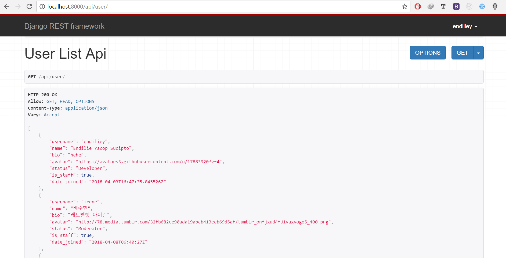
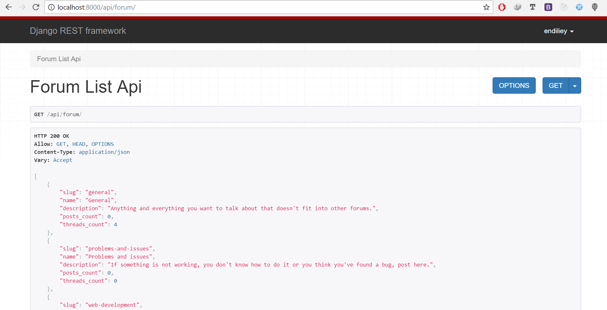
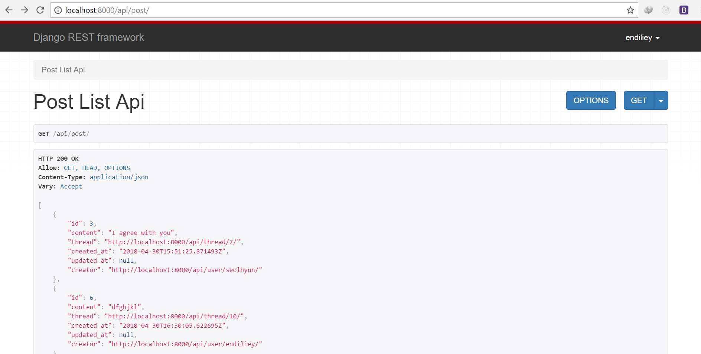
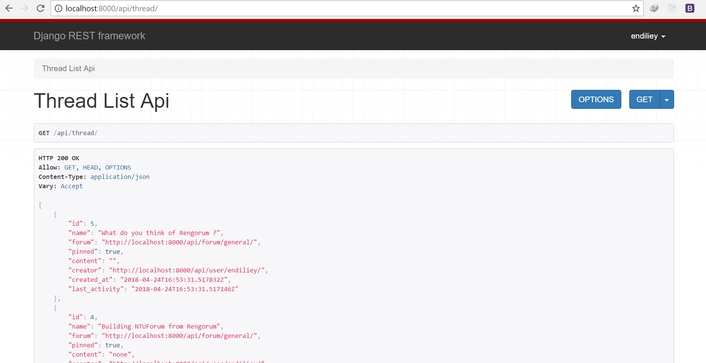

# Rengorum
Single-page forum application that aims to be fast, performant and simple.


## Frontend
> The frontend is a fast, interactive and simple Single-Page-Application (SPA), written in ES6 Javascript and built with following technologies:
> * [React v16](https://facebook.github.io/react/)
> * [Redux v5](http://redux.js.org/)
> * [React Router v4](https://github.com/ReactTraining/react-router)
> * [Redux Thunk v2](https://github.com/gaearon/redux-thunk)
> * [Redux Persist v5.9](https://github.com/rt2zz/redux-persist)
> * [etc](https://github.com/endiliey/rengorum/blob/master/frontend/package.json)

### Screenshots:


## Backend
> The backend is a scalable system that provides data through its RESTful API (browseable API available), written in Python and built with following technologies:
> * [Django v2.0](https://www.djangoproject.com/)
> * [Djangorestframework v3.7](http://www.django-rest-framework.org/)
> * [etc](https://github.com/endiliey/rengorum/blob/master/requirements.txt)

```
List of available API (browseable) at /api
* /user
* /user/login/
* /user/register/
* /user/logout/
* /user/{username}/
* /user/{username}/edit
* /user/{username}/delete
* /forum/
* /forum/create/
* /forum/{slug}/
* /forum/{slug}/edit/
* /forum/{slug}/delete/
* /thread/
* /thread/create/
* /thread/{id}/
* /thread/{id}/edit/
* /thread/{id}/delete/
* /post/
* /post/create/
* /post/{id}/
* /post/{id}/edit/
* /post/{id}/delete/
```

### Screenshots:





## Development setup

Make sure you have following software installed in your system:
* Python 3
* Node.js
* NPM / Yarn
* Git

First, we need to clone the repository
```
git clone https://github.com/endiliey/rengorum.git
```

Setup a [virtualenv](https://virtualenv.pypa.io/en/stable/)
```
pip install virtualenv
```

Create an isolated environments through virtualenv, note that it must be Python 3, because I'm using latest Django version (v2)
```
cd rengorum
virtualenv venv -p python3
```

Activate virtualenv
```
source venv/bin/activate
```

Install all required dependencies for backend by typing
```
pip install -r requirements.txt
```

Install all required dependencies for frontend by typing
```
cd frontend
npm install
```

*Note: Exit python virtualenv by
```
deactivate
```

## Running Backend on Local Server
Make sure you've activated your virtualenv, activate by
```
source venv/bin/activate
```

Make sure backend testcases that I've wrote is not failing
```
python manage.py test
```

Then run the server, api endpoint should be available on http://localhost:8000/api

```
cd backend
python manage.py runserver
```

## Running Frontend on Local Server
Make sure you've installed all the dependencies for frontend before, then
```
cd frontend
npm start
```

Frontend should be available on http://localhost:3000/
